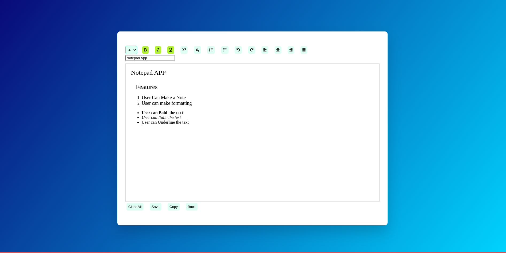

#Code is going on

Done by now:

- Text Editor Done
- Basis Editing Done
- Save Button
- Back Button
- User can copy all text by click of a button
- User can see the list of notes made by user
- Design Integration

To Do:

- User can create a new note and can switch between notes

- Live the project
- Documentation

Features:

1. User can make a note
2. User can make some text bold / underlined
3. User can copy all text by click of a button
4. User can see the list of notes made by user
5. User can create a new note and can switch between notes

Images till now:

